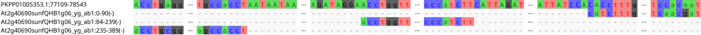

# LoCoLotive
In silico identification of low-copy nuclear loci based on published target capture probe sets and custom reference genomes.

## Requirements
- Linux OS
- [Docker](https://docs.docker.com/) **or** ([BEDOPS](https://bedops.readthedocs.io/en/latest/), [bedtools](https://bedtools.readthedocs.io/en/latest/), [FASTX-Toolkit](http://hannonlab.cshl.edu/fastx_toolkit/), [gawk](https://www.gnu.org/software/gawk/), [GenomeTools](http://genometools.org/), [MAFFT](https://mafft.cbrc.jp/alignment/software/), [BLAST](https://blast.ncbi.nlm.nih.gov/), [python3](https://www.python.org/), [R](https://www.r-project.org/), [ape](https://cran.r-project.org/web/packages/ape/), [seqinr](https://cran.r-project.org/web/packages/seqinr/)).

Depending on your Linux distribution, the latter tools can possibly be installed with

```raw
apt update && apt install bedops bedtools fastx-toolkit gawk genometools mafft ncbi-blast+ python3 r-base r-base-dev
```

and

```raw
Rscript -e 'install.packages(c("ape", "seqinr"), repos="https://cloud.r-project.org")'
```

**Alternatively**, you can use the supplied Docker image, which already contains all dependencies required:

1. Install [Docker](https://docs.docker.com/engine/install/).
2. Run `docker pull ulbio/locolotive` to download and import the docker image.

Since compatibility with future versions of the external tools cannot be guaranteed, **it is safer and therefore recommended to use the Docker image** rather than local installations.
Note that this image does NOT support the Windows Subsystem for Linux (WSL).

## Usage
First download LoCoLotive and move into the LoCoLotive directory:
```bash
git clone https://github.com/AGOberprieler/LoCoLotive
cd LoCoLotive
```

The whole pipeline can be run using the main script run.py. When using the Docker image, simply prepend `./docker.sh` to any command calls such as `./docker.sh ./run.py -h`.
The latter command will list all available options:

```raw
usage: run.py [-h] [-a ANNOTATION] [-e EVALUE] [-i] [-m MC_LENGTH] [-r] probes genome

positional arguments:
  probes                Probe sequences (FASTA file)
  genome                Reference genome (FASTA file)

optional arguments:
  -h, --help            show this help message and exit
  -a ANNOTATION, --annotation ANNOTATION
                        Genome annotation (GFF3 file, optional)
  -e EVALUE, --evalue EVALUE
                        E-value threshold for saving BLAST hits (default:
                        1e-5)
  -i, --relax_intron_def
                        Relax definition of intronic regions to include even
                        exon-overlapping parts. (legacy option)
  -m MC_LENGTH, --mc_length MC_LENGTH
                        Probes with multi-copy regions of at least MC_LENGTH
                        bp will be discarded. (default: 15)
  -r, --run_all         (Re)run all intermediate steps. This may be useful, if
                        previous runs have been interrupted.
```

As a minimum, two FASTA files, i.e., probe sequences and reference genome, are required to run the pipeline.
If an additional GFF3 file comprising exon information is provided via the `-a` option, intronic regions will be highlighted as uppercase in the created MSAs.
In this case, intronic bases located between consecutive BLAST hits of the same probe sequence will also be reported in the tabular output file (summary.txt).

**NOTE**:
- The main script run.py has to be executed **inside the LoCoLotive directory**. When using the Docker image, all input files must also be placed in this directory!
- If MC_LENGTH is too high, it is more likely that, in the final MSAs, parts of probe sequences will be mapped to different reference positions than suggested by BLAST, possibly requiring manual correction. However, summary.txt will not be affected by this problem.

## Example

### Input preparation

For illustration, we will use LoCoLotive to filter Compositae-specific probe sequences (Mandel et al. 2014). Genome assembly ASM311234v1 (Shen et al. 2018) for *Artemisia annua* will be used as an annotated reference.

1. Download reference genome from NCBI: https://www.ncbi.nlm.nih.gov/data-hub/assembly/GCA_003112345.1/ (download "Genomic sequence (FASTA)" and "Annotated features (GFF3)" and extract the files from the download archive)
2. Download probe sequences, more precisely the source ESTs used for probe design: https://raw.githubusercontent.com/Smithsonian/Compositae-COS-workflow/master/COS_sunf_lett_saff_all.fasta
3. Move/copy both FASTA files and the GFF file into the LoCoLotive directory.

To avoid redundant loci, we will only use source ESTs from sunflower.
These can be extracted with

```raw
egrep ">.{9}sunf" COS_sunf_lett_saff_all.fasta -A1 | grep -v "^--$" > sunf.fasta
```

Before running the pipeline, it is generally a good idea to ensure that the input files do not contain Windows-like line breaks. If you are unsure, you can use [dos2unix](https://waterlan.home.xs4all.nl/dos2unix/dos2unix.htm) to sanitize the files (e.g., `dos2unix sunf.fasta`).

### Running LoCoLotive

Now, we will run LoCoLotive with default parameters (adjust the file names/paths if necessary):

```raw
./run.py -a genomic.gff sunf.fasta GCA_003112345.1_ASM311234v1_genomic.fna
```

Remember that you have to prepend `./docker.sh ` when using the supplied Docker image!

The screen output of the above command should be similar to the following:

```raw
check input files...
extract intronic regions...
create BLAST database...


Building a new DB, current time: 04/21/2022 05:59:01
New DB name:   /home/uli/LoCoLotive/sunf/GCA_003112345.1_ASM311234v1_genomic/GCA_003112345.1_ASM311234v1_genomic.fna
New DB title:  ../GCA_003112345.1_ASM311234v1_genomic.fna
Sequence type: Nucleotide
Keep MBits: T
Maximum file size: 2000000000B
Adding sequences from FASTA; added 39400 sequences in 23.1302 seconds.

BLAST probe sequences against reference genome (this may take some time)...

filter probe sequences:

remove query IDs with less than 2 blast hits...
[########################################] 1046 of 1046 processed
83 discarded

remove query IDs with hits on different chromosomes/scaffolds/contigs etc. ...
[########################################] 963 of 963 processed
859 discarded

remove query IDs with hits on both strands...
[########################################] 104 of 104 processed
1 discarded

remove query IDs with multi-copy regions of at least 15 bp...
[########################################] 103 of 103 processed
39 discarded

number of BLAST hits per probe sequence after filtering:
2 hits: 43 probes
3 hits: 9 probes
4 hits: 5 probes
5 hits: 5 probes
6 hits: 1 probes
7 hits: 1 probes

create alignments...
index file ../GCA_003112345.1_ASM311234v1_genomic.fna.fai not found, generating...
index file ../sunf.fasta.fai not found, generating...
[########################################] 64 of 64 processed

summarize results...
```

In this case, 64 out of 1046 probe sequences have passed the filtering steps.

### Output

The outputs of the pipeline are stored in a directory whose name corresponds to the used probe sequence file:

```raw
sunf
├── GCA_003112345.1_ASM311234v1_genomic
│   ├── e_thresh_1e-5
│   │   ├── mc_thresh_15
│   │   │   ├── alignments [64 files]
│   │   │   ├── genomic_ranges [64 files]
│   │   │   ├── hits_filtered [64 files]
│   │   │   ├── query_coverage [64 files]
│   │   │   ├── query_intervals [64 files]
│   │   │   ├── filtering.log
│   │   │   ├── hits_filtered.csv
│   │   │   └── summary.txt
│   │   └── blast_hits.txt
│   ├── exonic.BED
│   ├── GCA_003112345.1_ASM311234v1_genomic_ann.md5
│   ├── GCA_003112345.1_ASM311234v1_genomic.fna.nhr
│   ├── GCA_003112345.1_ASM311234v1_genomic.fna.nin
│   ├── GCA_003112345.1_ASM311234v1_genomic.fna.nsq
│   ├── GCA_003112345.1_ASM311234v1_genomic.md5
│   ├── intronic.BED
│   └── intronic_strict.BED
└── sunf.md5
```

The most relevant outputs are the MSAs in the "alignments" directory and "summary.txt", a tab-delimited table summarizing important information about each probe sequence that has passed the filtering steps.

summary.txt looks as follows:

```raw
At2g41490sunfQHB39M10_yg_ab1  2737  7  554,107,86,201,220,919  554,106,86,201,179,707
At2g45740sunfQHA6E16_yg_ab1   1075  6  88,76,126,73,92         88,76,126,73,92
At2g25310sunfQHB27H08_yg_ab1  2393  5  340,858,77,660          340,858,77,660
...
At2g40690sunfQHB1g06_yg_ab1   1434  3  577,458                 577,458
...
At1g77550sunf32541543         281   2  92                      92
At3g10330sunfQHF9F04_yg_ab1   271   2  82                      82
At4g36440sunfQHK9D01_yg_ab1   230   2  93                      83
```

- column 1: probe sequence ID
- column 2: alignment length
- column 3: number of BLAST hits
- column 4: distance between consecutive BLAST hits [bp]
- column 5: intronic base pairs between consecutive BLAST hits

Note that columns 4 and 5 refer to the original BLAST hits rather than the MSAs produced by MAFFT.
If no exon annotation is provided, column 5 will only contain zeros. 

For source EST *At2g40690sunfQHB1g06_yg_ab1* (see above for comparison), the output MSA looks as follows:



The first sequence is part of the referene genome while the other ones represent matched parts of *At2g40690sunfQHB1g06_yg_ab1*.
Note that the latter sequences have been reverse-complemented as indicated by the minus signs.

To quickly inspect which parts of a probe sequence have been matched by BLAST, you can have a look at the files in "query_coverage".
The other sub-directories, namely "hits_filtered", "genomic_ranges" and "query_intervals" contain intermediate results and are no longer needed except for debugging purposes. For each of the discarded probe sequences, "filtering.log" lists why it has been discarded.

If the pipeline is again applied to the same probe sequences, but using another reference or different parameter settings, a new branch will be added to the output directory tree.
For instance, after a second run with a lower MC_LENGTH setting 

```raw
./run.py -m 10 -a genomic.gff sunf.fasta GCA_003112345.1_ASM311234v1_genomic.fna
```

which implies a stricter filtering, the following directories will be present:

```raw
sunf
├── GCA_003112345.1_ASM311234v1_genomic
│   ├── e_thresh_1e-5
│   │   ├── mc_thresh_10
│   │   │   ├── alignments [61 files]
│   │   │   ├── genomic_ranges [61 files]
│   │   │   ├── hits_filtered [61 files]
│   │   │   ├── query_coverage [61 files]
│   │   │   ├── query_intervals [61 files]
│   │   │   ├── filtering.log
│   │   │   ├── hits_filtered.csv
│   │   │   └── summary.txt
│   │   ├── mc_thresh_15
│   │   │   ├── alignments [64 files]
│   │   │   ├── genomic_ranges [64 files]
│   │   │   ├── hits_filtered [64 files]
│   │   │   ├── query_coverage [64 files]
│   │   │   ├── query_intervals [64 files]
│   │   │   ├── filtering.log
│   │   │   ├── hits_filtered.csv
│   │   │   └── summary.txt
│   │   └── blast_hits.txt
│   ├── exonic.BED
│   ├── GCA_003112345.1_ASM311234v1_genomic_ann.md5
│   ├── GCA_003112345.1_ASM311234v1_genomic.fna.nhr
│   ├── GCA_003112345.1_ASM311234v1_genomic.fna.nin
│   ├── GCA_003112345.1_ASM311234v1_genomic.fna.nsq
│   ├── GCA_003112345.1_ASM311234v1_genomic.md5
│   ├── intronic.BED
│   └── intronic_strict.BED
└── sunf.md5
```

For the second run, only 61 probe sequences have passed the filtering steps.

Note that the second command also runs much faster because upstream results (e.g. BLAST results) generated by the first run are reused. If necessary, this behavior can be altered using the `-r`/`--run_all` option.
