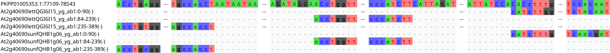

# LoCoLotive
In silico identification of low-copy nuclear loci based on published target capture probe sets and arbitrary reference genomes.

## Requirements
LoCoLotive is primarily designed to run on Linux operating systems and depends on several external tools, programming languages and libraries, namely [BEDOPS](https://bedops.readthedocs.io/en/latest/), [bedtools](https://bedtools.readthedocs.io/en/latest/), [FASTX-Toolkit](http://hannonlab.cshl.edu/fastx_toolkit/), [gawk](https://www.gnu.org/software/gawk/), [GenomeTools](http://genometools.org/), [MAFFT](https://mafft.cbrc.jp/alignment/software/), [BLAST](https://blast.ncbi.nlm.nih.gov/), [python3](https://www.python.org/), [R](https://www.r-project.org/), [ape](https://cran.r-project.org/web/packages/ape/), [seqinr](https://cran.r-project.org/web/packages/seqinr/), [NumPy](https://numpy.org/) and [SciPy](https://scipy.org/citing-scipy/).

There are several ways to deal with the required dependencies.

### Option 1: Manual installation
On Debian-based Linux distributions, LoCoLotive's dependencies can be installed using the following or similar commands. (Some of them may require root privileges, which can be given by prepending "sudo".)

```raw
apt update && apt install bedops bedtools fastx-toolkit gawk genometools mafft ncbi-blast+ python3 r-base r-base-dev
python3 -m pip install --user numpy scipy
Rscript -e 'install.packages(c("ape", "seqinr"), repos="https://cloud.r-project.org")'
```

Note: Since compatibility with arbitrary/future versions of the mentioned packages cannot be guaranteed, **it is safer and therefore recommended to use either option 2 or 3 instead**, which will provide defined and tested software versions.

### Option 2: Conda environment

Using the Conda package management system, it is possible to easily create an appropriate environment for running LoCoLotive without system-wide installations and thus without root privileges. If not already installed, Conda (here [Miniconda](https://docs.conda.io/en/main/miniconda.html)) can typically be installed using the following commands:
```bash
wget https://repo.anaconda.com/miniconda/Miniconda3-latest-Linux-x86_64.sh
bash Miniconda3-latest-Linux-x86_64.sh
```
Alternatively, you may want to consider [Mambaforge](https://github.com/conda-forge/miniforge), which enables much faster package installation and is less prone to dependency conflicts. It can typically be installed with 
```bash
wget https://github.com/conda-forge/miniforge/releases/latest/download/Mambaforge-Linux-x86_64.sh
bash Mambaforge-Linux-x86_64.sh
```

Next, download LoCoLotive and enter the corresponding directory:
```bash
git clone https://github.com/AGOberprieler/LoCoLotive
cd LoCoLotive
```

You can then create a Conda environment called "locolotive" with `conda env create -f environment.yml` (when using Mambaforge, simply replace `conda` with `mamba` to benefit from its improvements). Finally activate the environment by executing `conda activate locolotive` to be able to run LoCoLotive from your current terminal session. The latter step is usually necessary each time you open up a new (pseudo)terminal. Within the activated environment, commands like, e.g., `python3` (probably also installed system-wide) now point to programs from your environment, which can, e.g., be verified with `which python3`.

### Option 3: Docker image

For a maximum of reproducibility, you can run LoCoLotive inside a Docker image, which packages not only the above mentioned dependencies, but a complete operating system.

1. Install Docker, see https://docs.docker.com/engine/install/. Typically, you also have to create and join a "docker" group, see https://docs.docker.com/engine/install/linux-postinstall/.
2. Run `docker pull ul90/locolotive` to download and import the Docker image. Note that this image does not support the Windows Subsystem for Linux (WSL).

The docker.sh script will be used run LoCoLotive using the image. (see below)


## Usage
If not already done, download LoCoLotive and move into the LoCoLotive directory:
```bash
git clone https://github.com/AGOberprieler/LoCoLotive
cd LoCoLotive
```

The whole pipeline can be run using the main script run.py. When using the Docker image, simply prepend `./docker.sh` to any command calls such as `./docker.sh ./run.py -h`.
The latter command will list all available options:

```raw
usage: run.py [-h] [-a ANNOTATION] [-e EVALUE] [-i] [-m MC_LENGTH] [-r] targets genome

positional arguments:
  targets               Target sequences used for probe design (FASTA file)
  genome                Reference genome (FASTA file)

optional arguments:
  -h, --help            show this help message and exit
  -a ANNOTATION, --annotation ANNOTATION
                        Genome annotation (GFF3 file, optional)
  -e EVALUE, --evalue EVALUE
                        E-value threshold for saving BLAST hits (default: 1e-5)
  -i, --relax_intron_def
                        Relax definition of intronic regions to include even
                        exon-overlapping parts. (legacy option)
  -m MC_LENGTH, --mc_length MC_LENGTH
                        Targets with multi-copy regions of at least MC_LENGTH bp
                        will be discarded. (default: 15)
  -r, --run_all         (Re)run all intermediate steps. This may be useful, if
                        previous runs have been interrupted.

```

As a minimum, two FASTA files, i.e., target sequences and reference genome, are required to run the pipeline.
If an additional GFF3 file comprising exon information is provided via the `-a` option, intronic regions will be highlighted as uppercase in the created MSAs.
In this case, intronic bases located between consecutive BLAST hits of the same target sequence (not to be confused with "subject sequences" of BLAST!) will also be reported in the tabular output file (summary.txt).

**NOTE**:
- The main script run.py has to be executed **inside the LoCoLotive directory**. When using the Docker image, all input files must also be placed in this directory!
- If MC_LENGTH is too high, it is more likely that, in the final MSAs (produced by MAFFT), parts of target sequences will be aligned to different reference positions than suggested by BLAST, possibly requiring manual correction. However, summary.txt will not be affected by this problem.

## Example 1

### Input preparation

For illustration, we will use LoCoLotive to filter Compositae-specific target sequences (Mandel et al. 2014). Genome assembly ASM311234v1 (Shen et al. 2018) for *Artemisia annua* will be used as an annotated reference.

1. Download reference genome from NCBI: https://www.ncbi.nlm.nih.gov/data-hub/assembly/GCA_003112345.1/ (download "Genomic sequence (FASTA)" and "Annotated features (GFF3)" and extract the files from the download archive)
2. Download target sequences, i.e., the source ESTs used for probe design: https://raw.githubusercontent.com/Smithsonian/Compositae-COS-workflow/master/COS_sunf_lett_saff_all.fasta
3. Move/copy both FASTA files and the GFF file into the LoCoLotive directory.

To avoid redundant loci, we will only use source ESTs from sunflower.
These can be extracted with

```bash
egrep ">.{9}sunf" COS_sunf_lett_saff_all.fasta -A1 | grep -v "^--$" > sunf.fasta
```

Before running the pipeline, it is generally a good idea to ensure that the input files do not contain Windows-like line breaks. If you are unsure, you can use [dos2unix](https://waterlan.home.xs4all.nl/dos2unix/dos2unix.htm) to sanitize the files (e.g., `dos2unix sunf.fasta`).

### Running LoCoLotive

Now, we will run LoCoLotive with default parameters (adjust the file names/paths if necessary):

```bash
./run.py -a genomic.gff sunf.fasta GCA_003112345.1_ASM311234v1_genomic.fna
```

(Remember to activate your Conda environment before or to prepend `./docker.sh` if appropriate.)

The screen output of the above command should be similar to the following:

```raw
check input files...
extract intronic regions...

create BLAST database...

Building a new DB, current time: 01/06/2023 00:00:00
New DB name:   /home/uli/LoCoLotive/sunf/GCA_003112345.1_ASM311234v1_genomic/GCA_003112345.1_ASM311234v1_genomic.fna
New DB title:  GCA_003112345.1_ASM311234v1_genomic.fna
Sequence type: Nucleotide
Keep MBits: T
Maximum file size: 2000000000B
Adding sequences from FASTA; added 39400 sequences in 21.1611 seconds.

BLAST target sequences against reference genome (this may take some time)...

filter target sequences:

remove query IDs with less than 2 blast hits...
[########################################] 1046 of 1046 processed
83 discarded

remove query IDs with hits on different chromosomes/scaffolds/contigs etc. ...
[########################################] 963 of 963 processed
859 discarded

remove query IDs with hits on both strands...
[########################################] 104 of 104 processed
1 discarded

remove query IDs with multi-copy regions of at least 15 bp...
[########################################] 103 of 103 processed
39 discarded

number of BLAST hits per target sequence after filtering:
2 hits: 43 targets
3 hits: 9 targets
4 hits: 5 targets
5 hits: 5 targets
6 hits: 1 targets
7 hits: 1 targets

create alignments...
index file GCA_003112345.1_ASM311234v1_genomic.fna.fai not found, generating...
index file sunf.fasta.fai not found, generating...
[########################################] 64 of 64 processed

summarize results...
```

In this case, 64 out of 1046 target sequences have passed the filtering steps.

### Output

The outputs of the pipeline are stored in a directory whose name corresponds to the used target sequence file:

```raw
sunf
├── GCA_003112345.1_ASM311234v1_genomic
│   ├── e_thresh_1e-5
│   │   ├── mc_thresh_15
│   │   │   ├── alignments [64 files]
│   │   │   ├── query_coverage [64 files]
│   │   │   ├── hits_filtered [64 files]
│   │   │   ├── overlapping_loci.txt
│   │   │   ├── groups_of_overlapping_loci.txt
│   │   │   ├── filtering.log
│   │   │   ├── mafft.log
│   │   │   ├── hits_filtered.csv
│   │   │   └── summary.txt
│   │   └── blast_hits.txt
│   ├── exonic.BED
│   ├── GCA_003112345.1_ASM311234v1_genomic_ann.md5
│   ├── GCA_003112345.1_ASM311234v1_genomic.fna.nhr
│   ├── GCA_003112345.1_ASM311234v1_genomic.fna.nin
│   ├── GCA_003112345.1_ASM311234v1_genomic.fna.nsq
│   ├── GCA_003112345.1_ASM311234v1_genomic.md5
│   ├── intronic.BED
│   └── intronic_strict.BED
└── sunf.md5
```

The most relevant outputs are the MSAs in the "alignments" directory and "summary.txt", a tab-delimited table summarizing important information about each target sequence that has passed the filtering steps.

summary.txt looks as follows:

```raw
At2g41490sunfQHB39M10_yg_ab1  2737  7  554,107,86,201,220,919  554,106,86,201,179,707
At2g45740sunfQHA6E16_yg_ab1   1075  6  88,76,126,73,92         88,76,126,73,92
At2g25310sunfQHB27H08_yg_ab1  2393  5  340,858,77,660          340,858,77,660
...
At2g40690sunfQHB1g06_yg_ab1   1434  3  577,458                 577,458
...
At1g77550sunf32541543         281   2  92                      92
At3g10330sunfQHF9F04_yg_ab1   271   2  82                      82
At4g36440sunfQHK9D01_yg_ab1   230   2  93                      83
```

- column 1: target sequence ID
- column 2: alignment length
- column 3: number of BLAST hits
- column 4: distance between consecutive BLAST hits [bp]
- column 5: intronic base pairs between consecutive BLAST hits

Note that columns 4 and 5 refer to the original BLAST hits rather than the MSAs produced by MAFFT.
If no exon annotation is provided, column 5 will only contain zeros. 

For source EST *At2g40690sunfQHB1g06_yg_ab1* (see above for comparison), the output MSA looks as follows:


The first sequence is part of the referene genome while the other ones represent matched parts of *At2g40690sunfQHB1g06_yg_ab1*.
Note that the latter sequences have been reverse-complemented as indicated by the minus signs.

To quickly inspect which parts of a target sequence have been aligned by BLAST, you can have a look at the files in "query_coverage".
"hits_filtered" contains intermediate results and is no longer needed except for debugging purposes. For each of the discarded target sequences, "filtering.log" lists why it has been discarded.
Here, overlapping_loci.txt and groups_of_overlapping_loci.txt are irrelevant. (see Example 2 for further explanation)

If the pipeline is again applied to the same target sequences, but using another reference or different parameter settings, a new branch will be added to the output directory tree.
For instance, after a second run with a lower MC_LENGTH setting 

```bash
./docker.sh ./run.py -m 10 -a genomic.gff sunf.fasta GCA_003112345.1_ASM311234v1_genomic.fna
```

which implies a stricter filtering, the following directories will be present:

```raw
sunf
├── GCA_003112345.1_ASM311234v1_genomic
│   ├── e_thresh_1e-5
│   │   ├── mc_thresh_10
│   │   │   ├── alignments [61 files]
│   │   │   ├── query_coverage [61 files]
│   │   │   ├── hits_filtered [61 files]
│   │   │   ├── overlapping_loci.txt
│   │   │   ├── groups_of_overlapping_loci.txt
│   │   │   ├── filtering.log
│   │   │   ├── mafft.log
│   │   │   ├── hits_filtered.csv
│   │   │   └── summary.txt
│   │   ├── mc_thresh_15
│   │   │   ├── alignments [64 files]
│   │   │   ├── query_coverage [64 files]
│   │   │   ├── hits_filtered [64 files]
│   │   │   ├── overlapping_loci.txt
│   │   │   ├── groups_of_overlapping_loci.txt
│   │   │   ├── filtering.log
│   │   │   ├── mafft.log
│   │   │   ├── hits_filtered.csv
│   │   │   └── summary.txt
│   │   └── blast_hits.txt
│   ├── exonic.BED
│   ├── GCA_003112345.1_ASM311234v1_genomic_ann.md5
│   ├── GCA_003112345.1_ASM311234v1_genomic.fna.nhr
│   ├── GCA_003112345.1_ASM311234v1_genomic.fna.nin
│   ├── GCA_003112345.1_ASM311234v1_genomic.fna.nsq
│   ├── GCA_003112345.1_ASM311234v1_genomic.md5
│   ├── intronic.BED
│   └── intronic_strict.BED
└── sunf.md5
```

For the second run, only 61 target sequences have passed the filtering steps.

Note that the second command also runs much faster because upstream results (e.g. BLAST results) generated by the first run are reused. If necessary, this behavior can be altered using the `-r`/`--run_all` option.


## Example 2 (overlapping loci)

In the first example, we only used ESTs from sunflower as input target sequences. We will now run a similar analysis using the complete set of ESTs to demonstrate LoCoLotives behaviour in presence of overlapping/redundant loci:

```bash
./run.py -a genomic.gff COS_sunf_lett_saff_all.fasta GCA_003112345.1_ASM311234v1_genomic.fna
```

Screen output:

```raw
check input files...
extract intronic regions...

create BLAST database...


Building a new DB, current time: 02/06/2023 00:00:00
New DB name:   /wd/COS_sunf_lett_saff_all/GCA_003112345.1_ASM311234v1_genomic/GCA_003112345.1_ASM311234v1_genomic.fna
New DB title:  GCA_003112345.1_ASM311234v1_genomic.fna
Sequence type: Nucleotide
Keep MBits: T
Maximum file size: 2000000000B
Adding sequences from FASTA; added 39400 sequences in 29.7582 seconds.


BLAST target sequences against reference genome (this may take some time)...

filter target sequences:

remove query IDs with less than 2 blast hits...
[########################################] 2565 of 2565 processed
164 discarded

remove query IDs with hits on different chromosomes/scaffolds/contigs etc. ...
[########################################] 2401 of 2401 processed
2157 discarded

remove query IDs with hits on both strands...
[########################################] 244 of 244 processed
1 discarded

remove query IDs with multi-copy regions of at least 15 bp...
[########################################] 243 of 243 processed
87 discarded

number of BLAST hits per target sequence after filtering:
2 hits: 97 targets
3 hits: 23 targets
4 hits: 11 targets
5 hits: 14 targets
6 hits: 9 targets
7 hits: 1 targets
8 hits: 1 targets

create alignments...
index file GCA_003112345.1_ASM311234v1_genomic.fna.fai not found, generating...
index file COS_sunf_lett_saff_all.fasta.fai not found, generating...
[########################################] 156 of 156 processed
overlapping loci found, compute group-wise alignments...
[########################################] 81 of 81 processed

summarize results...
```

We now obtained 156 candidate loci as opposed to 64 loci in example analysis 1.
As indicated above, however, many of them are overlapping and potentially redundant.

If there are at least two overlapping candidate loci, LoCoLotive detects disjunct groups of overlapping loci and generates additional outputs:

1. For each candidate locus (left), *overlapping_loci.txt* lists all other loci (right, comma-delimited) overlapping with the former, e.g.
```raw
At1g02640sunfQHB38G03_yg_ab1:
At1g05910lettQGG30P16_yg_ab1:      At1g05910sunfQHG3c10_yg_ab1
At1g05910sunfQHG3c10_yg_ab1:       At1g05910lettQGG30P16_yg_ab1
At1g06680lettQGF27N07_yg_ab1:      At1g06680saffCART_TINC_CSA1_1830,At1g06680sunf32531066
At1g06680saffCART_TINC_CSA1_1830:  At1g06680lettQGF27N07_yg_ab1,At1g06680sunf32531066
...
```
2. For each group of loci, *groups_of_overlapping_loci.txt* lists its members, e.g.
```raw
group 1: At2g26210lettQGE11A05_yg_ab1,At2g26210saffCART_TINC_CSA1_1006,At2g26210sunfQHF6P03_yg_ab1
group 2: At2g41490lettQGD10N23_yg_ab1,At2g41490saffCART_TINC_CSA1_6658,At2g41490sunfQHB39M10_yg_ab1
group 3: At2g24765lettQGJ1E16_yg_ab1
group 4: At3g19910lettQGF10N04_yg_ab1,At3g19910saffCART_TINC_CSA1_4513,At3g19910sunfQHB42M01_yg_ab1
group 5: At2g25310lettQGJ1G02_yg_ab1,At2g25310saffCART_TINC_CSA1_199,At2g25310sunfQHB27H08_yg_ab1
...
```
3. An additional column indicating group membership is appended to *summary.txt*, allowing to quickly recognize overlaps, e.g.
```raw
At2g26210saffCART_TINC_CSA1_1006  6244  8  1790,83,1488,943,297,74,785  1721,58,1488,796,297,51,738  1
At2g41490sunfQHB39M10_yg_ab1      2737  7  554,107,86,201,220,919       554,106,86,201,179,707       2
At2g24765lettQGJ1E16_yg_ab1       7449  6  101,84,6550,85,107           0,0,172,0,0                  3
At2g41490saffCART_TINC_CSA1_6658  4873  6  3153,175,79,554,108          3153,173,79,554,107          2
At3g19910saffCART_TINC_CSA1_4513  4345  6  598,69,124,2605,83           598,69,124,2541,83           4
...
```
- column 6: group ID

4. Additional MSAs are generated for each group, e.g.

This is almost identical to the MSA shown in example analysis 1, however, comprising redundant target sequences.

5. In analogy to *summary_groupwise.txt*, an additional output file *summary_groupwise.txt* provides an overview over each group of loci.
```raw
2   6639  10  3153,175,79,554,107,86,201,220,919  3153,173,79,554,106,86,201,179,707
1   6244  9   1790,83,1488,535,340,297,74,785     1721,58,1488,452,340,297,51,738
6   1792  7   95,129,118,111,427,88               95,129,118,110,427,88
3   7449  6   101,84,6550,85,107                  0,0,172,0,0
4   4345  6   598,69,124,2605,83                  598,69,124,2541,83
...
```
- column 1: group ID
- column 2: alignment length
- column 3: number of disjunct groups of overlapping BLAST hits
- column 4: distance between consecutive groups of BLAST hits [bp]
- column 5: intronic base pairs between consecutive groups of BLAST hits

Using the latter outputs, in our example, it may be more comfortable to inspect 81 effective loci (groups) instead of 156 potentially overlapping ones.
LoCoLotive's grouping behaviour is especially useful when it is unclear, which target sequences should be included in the analysis.
